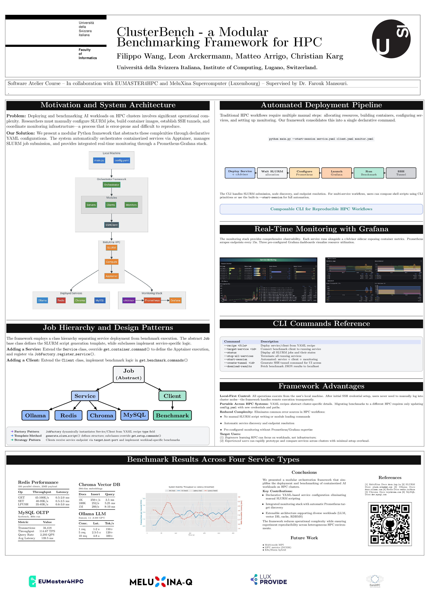

# ClusterBench

A modular Python orchestrator for running containerized AI benchmarking workloads on HPC clusters via SLURM.

[](https://philhippo.github.io/ClusterBench/)
[](LICENSE)

## Poster

[](poster.pdf)

*Click the image to view the full PDF poster*

## Overview

Deploy and benchmark AI services on the **MeluXina supercomputer** with:

- **Ollama** - LLM inference with GPU acceleration
- **Redis** - In-memory database benchmarking
- **Chroma** - Vector similarity search
- **MySQL** - Relational database benchmarks
- **Prometheus + Grafana** - Real-time monitoring

## Quick Start

```bash
# Install
git clone https://github.com/philhippo/ClusterBench.git
cd ClusterBench
pip install -r requirements.txt

# Configure (edit config.yaml with your credentials)

# Start a service
python main.py --recipe recipes/services/ollama.yaml

# Check status
python main.py --status

# Run benchmark
python main.py --recipe recipes/clients/ollama_benchmark.yaml --target-service <SERVICE_ID>

# Stop services
python main.py --stop-all-services
```

## Documentation

**[📚 Full Documentation](https://philhippo.github.io/ClusterBench/)**

- [Getting Started](https://philhippo.github.io/ClusterBench/getting-started/overview/)
- [Installation Guide](https://philhippo.github.io/ClusterBench/getting-started/installation/)
- [CLI Reference](https://philhippo.github.io/ClusterBench/cli/commands/)
- [Services Guide](https://philhippo.github.io/ClusterBench/services/overview/)
- [Monitoring](https://philhippo.github.io/ClusterBench/monitoring/overview/)

## Architecture

```
[CLI] → [Orchestrator] → [SSH] → [SLURM] → [Apptainer Containers]
                ↓
        [Prometheus] → [Grafana]
```

## Key Commands

| Command | Description |
|---------|-------------|
| `--recipe FILE` | Start service/client from YAML |
| `--status` | Show running jobs |
| `--stop-service ID` | Stop a service |
| `--stop-all-services` | Stop everything |
| `--download-results` | Get benchmark results |

## Project Structure

```
├── main.py              # CLI entry point
├── config.yaml          # HPC configuration
├── src/                 # Core modules
│   └── services/        # Service implementations
├── recipes/             # YAML configurations
│   ├── services/        # Service recipes
│   └── clients/         # Benchmark recipes
├── benchmark_scripts/   # Benchmark implementations
├── scripts/             # Automation scripts
└── docs-src/            # Documentation source
```

## Development

```bash
# Build documentation locally
pip install mkdocs-material mkdocs-mermaid2-plugin
mkdocs serve

# Run tests
pytest
```

## Contributing

1. Fork the repository
2. Create a feature branch
3. Submit a pull request

## License

MIT License - see [LICENSE](LICENSE)

---

**EUMaster4HPC Challenge 2025-2026**  
Software Atelier | EUMASTER4HPC | MeluXina  
Supervisor: Dr. Farouk Mansouri
