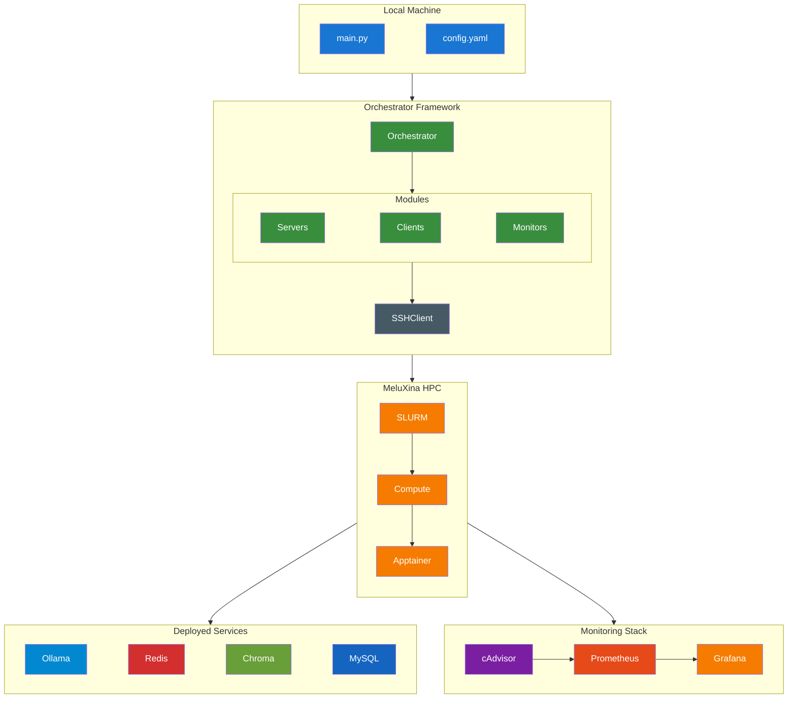

# ClusterBench

Welcome to the ClusterBench documentation.

## Overview

A modular Python orchestrator for running containerized AI benchmarking workloads on HPC clusters via SLURM. This framework enables automated deployment, benchmarking, and monitoring of AI services including LLM inference servers, vector databases, in-memory stores, and relational databases on the **MeluXina supercomputer**.

## Architecture



## Supported Services

| Service | Type | Port | Description |
|---------|------|------|-------------|
| **Ollama** | LLM Inference | 11434 | High-performance LLM inference server |
| **Redis** | In-Memory DB | 6379 | Key-value store with persistence |
| **Chroma** | Vector DB | 8000 | Vector similarity search |
| **MySQL** | RDBMS | 3306 | Relational database |
| **Prometheus** | Monitoring | 9090 | Metrics collection |
| **Grafana** | Visualization | 3000 | Real-time dashboards |

## Quick Start

```bash
# Install dependencies
pip install -r requirements.txt

# Start an Ollama service
python main.py --recipe recipes/services/ollama.yaml

# Check status
python main.py --status

# Run benchmark client
python main.py --recipe recipes/clients/ollama_benchmark.yaml --target-service <SERVICE_ID>

# View results in Grafana (after SSH tunnel)
open http://localhost:3000
```

## Documentation

| | |
|---|---|
| :rocket: **[Getting Started](getting-started/overview.md)** | Setup, installation, and your first benchmark |
| :building_construction: **[Architecture](architecture/overview.md)** | System design, components, and data flow |
| :gear: **[Services](services/overview.md)** | Ollama, Redis, Chroma, MySQL configuration |
| :computer: **[CLI Reference](cli/commands.md)** | Complete command-line interface documentation |
| :page_facing_up: **[Recipes](recipes/overview.md)** | YAML configuration for services and clients |
| :chart_with_upwards_trend: **[Monitoring](monitoring/overview.md)** | Grafana dashboards and Prometheus metrics |

## Key Features

- **YAML-based Configuration**: Define services and benchmarks declaratively
- **Multi-Service Support**: Ollama, Redis, Chroma, MySQL, and more
- **Automated SLURM Integration**: Seamless job submission and management
- **Real-time Monitoring**: Grafana dashboards with cAdvisor metrics
- **Parametric Benchmarking**: Sweep across multiple configurations
- **SSH Tunneling**: Secure access to HPC services

## Project Status

**Version**: 1.0.0  
**Last Updated**: January 2026  
**Project**: EUMaster4HPC Challenge 2025-2026  
**Supervisor**: Dr. Farouk Mansouri  
**Platform**: MeluXina Supercomputer

---

*Built for the Software Atelier course in collaboration with EUMASTER4HPC and LuxProvide*
